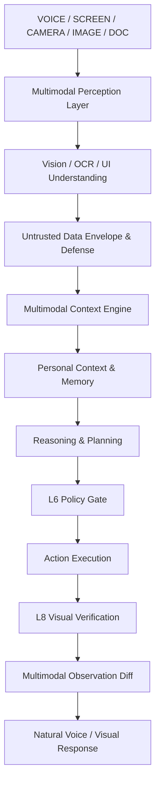

# Multimodal Architecture & Perceptual Pipeline

PIXEL Phase 16 transforms the personal assistant into a multimodal personal AI operating layer capable of understanding controlled visual input from cameras, screens, documents, and images, safely grounding actions in empirical observations.

## Architectural Layers

1. **Multimodal Providers (`services/multimodal/providers/`)**:
   - `BaseVisionProvider`, `BaseOCRProvider`, `BaseUIUnderstandingProvider`, `BaseDocumentVisualProvider`.
   - `LocalDeterministicVisionProvider`: High-performance on-device heuristic engine.
   - `VisionModelRouter`: Routes between `LOCAL`, `REMOTE`, and `HYBRID` tiers based on privacy and performance policies.

2. **Multilingual OCR Engine (`services/multimodal/ocr_engine.py`)**:
   - Extracts structured text lines, words, geometry bounding boxes, and detects languages (English, Hindi, Hinglish, Code).
   - Wraps all text outputs with `is_untrusted_data=True`.

3. **Screen Understanding & UI Grounding (`services/multimodal/screen_understanding.py`, `ui_grounding.py`)**:
   - Extracts `ScreenSemanticModel` with application hierarchy, dialogs, warnings, and buttons.
   - Grounding engine resolves user intents into exact pixel click coordinates `(X, Y)` with zero-guessing on ambiguous targets.

4. **Sensitive Region & Privacy Protection (`services/multimodal/sensitive_screen_detector.py`)**:
   - Automatic scanning and redaction of passwords, API keys, OTPs, payment card numbers, and PII.
   - Enforces local-only processing when sensitive data is detected.

5. **Camera & Screen Lifecycle Managers (`services/multimodal/camera_manager.py`, `screen_capture_manager.py`)**:
   - Explicit user authorization gating.
   - Ephemeral memory buffers with deterministic release to prevent surveillance creep.

6. **Visual Memory & Provenance (`services/multimodal/visual_memory_manager.py`)**:
   - Maintains `CURRENT_CONTEXT`, `TEMPORARY_CONTEXT`, `USER_APPROVED_MEMORY`, `DERIVED_FACT`.
   - Supports temporal TTL auto-expiration and right-to-forget purging.

7. **Visual Action Verifier (`services/multimodal/visual_verifier.py`)**:
   - Empirical pre/post action state diffing to verify UI transitions.
